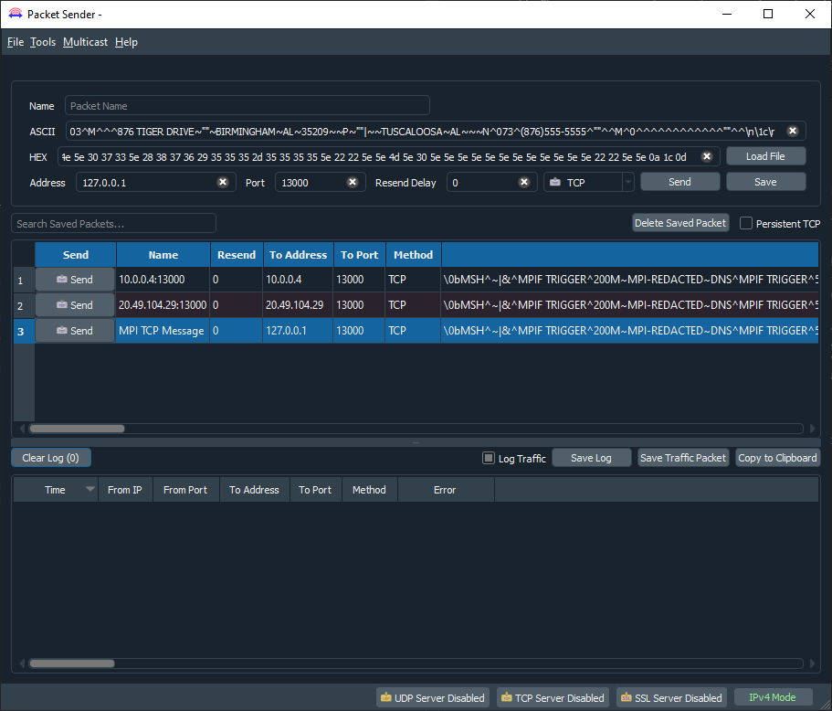

# MPI TCP Listener

## Introduction

Since the VBS application is incoporating the ability to search for a patient via social security number.  MPI requires that once a patient has been looked up, then that patient must be stored so that any metadata about that patient can be updated.  This update is currently done by MPI sending a TCP packet to a specific IPV4 address and port number..

## Test Data

To test this application locally, you need to be able to send TCP packet(s) that contains a valid HL7 message to an IPV4 address and port number.  For local development these values are stored in file `VBS.MPI_TCP_Listener\appsettings.json` in this section:

``` json
  "AppSettings": {
    "MpiEndPoint": "http://127.0.0.1:6000/mpi/sync/run",
    "ListeningPort": {{Desired Port Number}},
    "ListeningIPAddress": {{Desired IPV4 Address}},
    "MpiAckTcpAddress": "127.0.0.1",
    "MpiAckTcpPort": "22222"
  },
```

A suggested application to use is [Packet Sender by NagleCode](https://packetsender.com/download).  




1. Once running enter the following data into the field for ASCII 

``` ascii
\0bMSH^~|&^MPIF TRIGGER^200M~MPI-REDACTED~DNS^MPIF TRIGGER^500~DEVCRN.REDACTED.VA.GOV~DNS^20020921203833-0500^^ADT~A24^200167165^P^2.4^^^AL^AL^\nEVN^^^^^12556~MVIUSER~ONE~~~~~~USVHA&&0363~L~~~NI~VA FACILITY ID&500&L^^500\nPID^1^1001170566V325869^1001170566V325869~~~USVHA&&0363~NI~VA FACILITY ID&200M&L|000064567~~~USSSA&&0363~SS~VA FACILITY ID&500&L|100000087~~~USVHA&&0363~PI~VA FACILITY ID&500&L^^MVIPATIENT~PTNAME3~~~~~L^MVIMAIDEN~~~~~~M^19780303^M^^^876 TIGER DRIVE~""~BIRMINGHAM~AL~35209~~P~""|~~TUSCALOOSA~AL~~~N^073^(876)555-5555^""^^M^0^^^^^^^^^^^^""^^\nPD1^^^VAMCSITE2~D~998\nPID^2^00000000000000000^00000000000000000~~~USVHA&&0363~NI~VA FACILITY ID&200M&L|000064567~~~USSSA&&0363~SS~VA FACILITY ID&500&L|5000~~~USVHA&&0363~PI~VA FACILITY ID&500&L^^MVIPATIENT~PTNAME3~~~~~L^MVIMAIDEN~~~~~~M^19780303^M^^^876 TIGER DRIVE~""~BIRMINGHAM~AL~35209~~P~""|~~TUSCALOOSA~AL~~~N^073^(876)555-5555^""^^M^0^^^^^^^^^^^^""^^\n\1c\r
```

2. Specify the Address and Port from the values saved in the `VBS.MPI_TCP_Listener\appsettings.json`
3. Click the **Send** button
